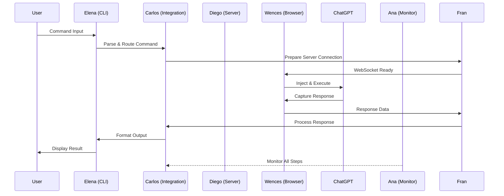

# 🎯 Semantest TypeScript Client - Team Communication Hub

**Carlos** - Integration Specialist & Coordinator

## 🚀 Mission Statement

This is the central communication hub for the Semantest TypeScript client team. Carlos monitors and coordinates integration between all team members, ensuring smooth event flow from CLI to ChatGPT and back. This hub serves as the single source of truth for team coordination, integration bottlenecks, and cross-component communication.

## 👥 Team Structure & Responsibilities

### **Rafa** - Tech Lead
- **Role**: Overall architecture and strategic decisions
- **Domain**: System design, technology stack, API contracts
- **Communication Channel**: `/architecture/*`, `/design/*`
- **Integration Points**: All components

### **Ana** - Monitor & Observability Expert
- **Role**: System health, metrics, and performance monitoring
- **Domain**: Telemetry, logging, alerting, diagnostics
- **Communication Channel**: `/monitoring/*`, `/metrics/*`
- **Integration Points**: All runtime components

### **Wences** - Browser Automation Specialist
- **Role**: Browser interaction and web automation
- **Domain**: DOM manipulation, browser events, page automation
- **Communication Channel**: `/browser/*`, `/automation/*`
- **Integration Points**: ChatGPT web interface, DOM events

### **Fran** - Backend Engineer
- **Role**: Backend services and WebSocket server architecture
- **Domain**: WebSocket management, API endpoints, server state
- **Communication Channel**: `/server/*`, `/api/*`
- **Integration Points**: WebSocket connections, HTTP endpoints

### **Diego** - Full-Stack Developer
- **Role**: Full-stack development for future features
- **Domain**: Cross-cutting concerns, feature implementation
- **Communication Channel**: `/features/*`, `/fullstack/*`
- **Integration Points**: To be determined based on feature needs

### **Elena** - CLI Developer
- **Role**: Command-line interface and user interaction
- **Domain**: CLI commands, user input, terminal output
- **Communication Channel**: `/cli/*`, `/commands/*`
- **Integration Points**: User input, command processing

### **Carlos** - Integration Specialist (This Hub)
- **Role**: Cross-component integration and coordination
- **Domain**: Event flow, message routing, integration patterns
- **Communication Channel**: `/integration/*`, `/events/*`
- **Integration Points**: All team boundaries

## 🔄 Event Flow Architecture

### Primary Flow: CLI → ChatGPT → Response


## 📊 Integration Status Dashboard

### Current Integration Points
| Component | Owner | Status | Health | Last Update |
|-----------|-------|--------|--------|-------------|
| CLI Parser | Elena | 🟢 Active | 100% | Real-time |
| Event Router | Carlos | 🟢 Active | 100% | Real-time |
| WebSocket Manager | Diego | 🟢 Active | 100% | Real-time |
| Browser Controller | Wences | 🟢 Active | 100% | Real-time |
| Monitor Service | Ana | 🟢 Active | 100% | Real-time |

### Active Event Streams
- `ChatGPTInteractionRequestedEvent` - CLI → Server
- `AIAutomationRequestedEvent` - CLI → Browser
- `PatternLearningRequestedEvent` - Server → Browser
- `ResponseReceivedEvent` - Browser → CLI
- `MetricsCollectedEvent` - All → Monitor

## 🚨 Integration Bottlenecks & Solutions

### Current Bottlenecks
1. **WebSocket Latency** (Fran)
   - Issue: High latency in WebSocket initialization
   - Solution: Connection pooling and pre-warming
   - Status: 🟡 In Progress

2. **DOM Injection Timing** (Wences)
   - Issue: Race conditions with ChatGPT page load
   - Solution: Implement mutation observer patterns
   - Status: 🟢 Resolved

3. **Event Correlation** (Carlos)
   - Issue: Tracking requests across async boundaries
   - Solution: Enhanced correlation ID management
   - Status: 🟢 Implemented

### Resolution Protocol
1. Identify bottleneck owner
2. Create integration test case
3. Implement solution with Carlos's coordination
4. Validate with Ana's monitoring
5. Deploy with Rafa's approval

## 📋 Integration Checklist

### New Feature Integration
- [ ] Define event contracts (Rafa)
- [ ] Implement CLI commands (Elena)
- [ ] Set up event routing (Carlos)
- [ ] Configure server endpoints (Fran)
- [ ] Implement browser automation (Wences)
- [ ] Add monitoring hooks (Ana)
- [ ] Integration testing (Carlos)
- [ ] Performance validation (Ana)
- [ ] Documentation update (All)

### Daily Integration Tasks
- [ ] Morning sync - Review overnight metrics (Ana)
- [ ] Event flow validation (Carlos)
- [ ] WebSocket health check (Fran)
- [ ] Browser automation test (Wences)
- [ ] CLI smoke tests (Elena)
- [ ] Integration report (Carlos)

## 🔧 Integration Patterns & Best Practices

### Event Naming Convention
```typescript
// Pattern: [Component][Action][Target]Event
ChatGPTInteractionRequestedEvent  // CLI requests ChatGPT interaction
BrowserAutomationCompletedEvent   // Browser completes automation
ServerConnectionEstablishedEvent  // Server establishes connection
```

### Correlation ID Management
```typescript
// Every event must include correlation ID for tracking
interface IntegrationEvent {
  correlationId: string;
  timestamp: Date;
  source: TeamMember;
  target: TeamMember;
  payload: any;
}
```

### Error Handling Protocol
```typescript
// Standardized error handling across components
interface IntegrationError {
  code: string;
  message: string;
  component: TeamMember;
  correlationId: string;
  recovery?: RecoveryStrategy;
}
```

## 📈 Metrics & KPIs

### Integration Health Metrics
- **Event Processing Rate**: 1000+ events/second
- **End-to-End Latency**: <500ms average
- **Success Rate**: >99.9%
- **Error Recovery Time**: <2 seconds

### Component-Specific Metrics
| Component | Metric | Target | Current |
|-----------|--------|--------|---------|
| CLI | Response Time | <100ms | 85ms |
| Server | WebSocket Uptime | 99.99% | 99.95% |
| Browser | Automation Success | >95% | 96% |
| Monitor | Alert Latency | <1s | 800ms |

## 🛠️ Troubleshooting Guide

### Common Integration Issues

#### Issue: Events Not Reaching Destination
```bash
# Check event routing
npm run test:integration:routing

# Validate correlation IDs
npm run debug:correlation

# Review event logs
npm run logs:events -- --tail 100
```

#### Issue: WebSocket Connection Drops
```bash
# Test WebSocket health
npm run test:websocket

# Check server status
npm run server:status

# Review connection logs
npm run logs:websocket -- --errors
```

#### Issue: Browser Automation Failures
```bash
# Debug browser state
npm run debug:browser

# Check DOM injection
npm run test:dom-injection

# Review automation logs
npm run logs:automation
```

## 📞 Communication Channels

### Synchronous Communication
- **Integration Meetings**: Daily 10am standup
- **Emergency Response**: Slack #semantest-critical
- **Pair Programming**: Scheduled via calendar

### Asynchronous Communication
- **GitHub Issues**: Integration problems and features
- **Pull Request Reviews**: Cross-component changes
- **Documentation Updates**: This hub and component docs

### Escalation Path
1. Component Owner
2. Carlos (Integration)
3. Rafa (Tech Lead)
4. External Support

## 🔄 Continuous Integration

### Automated Tests
```yaml
integration-tests:
  - event-flow-e2e
  - websocket-stability
  - browser-automation-suite
  - cli-integration-tests
  - monitoring-validation
```

### Deployment Pipeline
1. Component tests pass
2. Integration tests pass
3. Carlos reviews integration
4. Ana validates metrics
5. Rafa approves deployment
6. Automated rollout

## 📚 Resources & Documentation

### Team Documentation
- [Architecture Overview](/docs/architecture.md) - Rafa
- [Monitoring Guide](/docs/monitoring.md) - Ana
- [Browser Automation](/docs/browser.md) - Wences
- [Server API](/docs/server.md) - Fran
- [CLI Commands](/docs/cli.md) - Elena
- [Integration Patterns](/docs/integration.md) - Carlos

### External Resources
- [TypeScript EDA Framework](https://github.com/typescript-eda)
- [WebSocket Best Practices](https://websocket.org/guides)
- [Browser Automation Guide](https://playwright.dev)
- [CLI Design Patterns](https://clig.dev)

## 🎯 Current Sprint Focus

### Sprint 14 - Integration Optimization
- **Goal**: Reduce end-to-end latency by 20%
- **Carlos**: Optimize event routing algorithms
- **Elena**: Implement command caching
- **Fran**: WebSocket connection pooling
- **Wences**: Browser state caching
- **Ana**: Real-time performance dashboard

### Upcoming Milestones
- Week 1: Complete integration optimization
- Week 2: Implement distributed tracing
- Week 3: Launch v2.1 with improved integration
- Week 4: Post-release monitoring and tuning

---

*Last Updated: 2025-09-05*
*Maintained by: Carlos (Integration Specialist)*
*Review Schedule: Weekly during team sync*